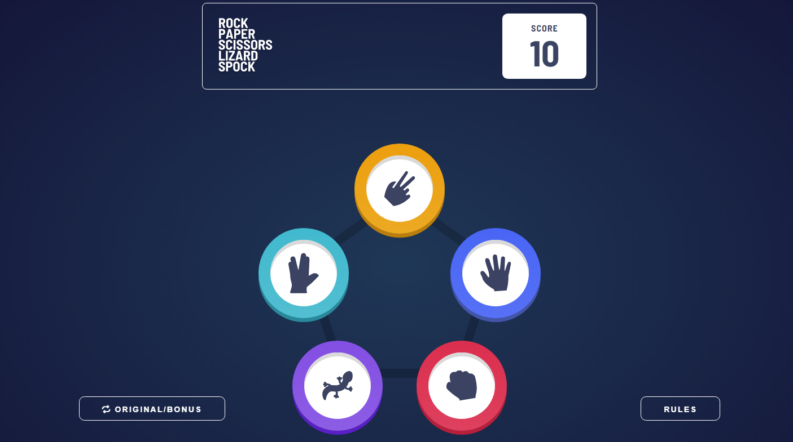

# Frontend Mentor - Rock, Paper, Scissors solution

This is a solution to the [Rock, Paper, Scissors challenge on Frontend Mentor](https://www.frontendmentor.io/challenges/rock-paper-scissors-game-pTgwgvgH). Frontend Mentor challenges help you improve your coding skills by building realistic projects.

## Table of contents

- [Overview](#overview)
  - [The challenge](#the-challenge)
  - [Screenshot](#screenshot)
  - [Links](#links)
- [My process](#my-process)
  - [Built with](#built-with)
  - [What I learned](#the-project--what-i-learned)
  - [Continued development](#continued-development)
  - [Useful resources](#useful-resources)
- [Author](#author)

## Overview

### The challenge

Users should be able to:

- View the optimal layout for the game depending on their device's screen size
- Play Rock, Paper, Scissors against the computer
- Maintain the state of the score after refreshing the browser _(optional)_
- **Bonus**: Play Rock, Paper, Scissors, Lizard, Spock against the computer _(optional)_

### Screenshot



### Links

- Solution URL: [Add solution URL here](https://your-solution-url.com)
- Live Site URL: [Add live site URL here](https://your-live-site-url.com)

## My process

### Built with

- Semantic HTML5 markup
- CSS custom properties
- Flexbox
- CSS Grid
- Mobile-first workflow
- JavaScript

### The project | What I learned

This project was quite fun to build and I learned a lot of things.

To start this project I coded every visual state of the game and defined what would trigger the state changes. The code was quite large and it took some time but it was worth it because I had an idea to build this game.

The game was implemented with classes but, looking back, I think it was kind of unnecessary because this game is too simple. But I wanted to practice some OOP principles, so it was good for me.

I also split up this project into several files because the code would be quite large otherwise. There's a file for rendering, utility functions, showRules, and the gestures. The main reason why I separated the gestures into a file(besides organization) was to use it later in the react version that I want to build. That's also why I gave each gesture an id.

I just used a simple logic so that I didn't need to hardcode every id.

```js
let nextId = 0;
export class Gesture {
  constructor(name, ...losers) {
    this.id = nextId++;
    this.name = name;
    this.losers = new Set(losers);
  }
}
Gesture.prototype.beats = function (gesture) {
  return this.losers.has(gesture.name);
};

const scissors = new Gesture("scissors", "paper", "lizard");
const paper = new Gesture("paper", "rock", "spock");
const rock = new Gesture("rock", "lizard", "scissors");
const lizard = new Gesture("lizard", "spock", "paper");
const spock = new Gesture("spock", "scissors", "rock");

export const originalGestures = [scissors, paper, rock];

export const bonusGestures = [scissors, paper, rock, lizard, spock];
```

This was the simplest way I could find to test whether a gesture beats another gesture. I thought of making an object called rules and for each property - which would be the name of the gesture - there would be an array with the respective losers for that property. But that would be harder to deal with I guess.

The App class has score because I thought of the it as something separate from the game, like the game is running and it can be lost or won and that's it. This class is also responsible for changing the game mode - which was a challenge for me at first because I had to think a lot to find a way to change the gestures of the game without creating too much tangledness.

```js
class App {
  constructor() {
    // I stored the score here because I thought of the game as something
    // separate from it.
    this.score = Number(localStorage.getItem("score")) || 0;
    const isOriginalGame = checkIsOriginalGame();

    const [header, scoreDOM] = renderHeader(isOriginalGame);
    this.headerDOM = elt("div", null, header);
    this.scoreDOM = scoreDOM;
    this.scoreDOM.textContent = this.score;

    const game = new Game(
      isOriginalGame ? originalGestures : bonusGestures,
      (status) => this.updateScore(status) // When the game ends, it calls this function
    );
    this.gameDOM = elt("div", null, game.dom);

    // The function to show the rules and change the game, respectively
    const buttons = renderBottomButtons(
      () => showRules(checkIsOriginalGame()),
      () => this.changeGame()
    );

    const footer = renderFooter();

    this.dom = elt(
      "div",
      { id: "wrapper" },
      this.headerDOM,
      this.gameDOM,
      buttons,
      footer
    );
  }

  updateScore(status) {
    // If it is a tie, nothing happens
    if (status === "won") {
      this.score += 1;
      this.scoreDOM.textContent = this.score;
      localStorage.setItem("score", this.score);
    } else if (status === "lost") {
      if (this.score > 0) this.score -= 1;
      this.scoreDOM.textContent = this.score;
      localStorage.setItem("score", this.score);
    }
  }

  changeGame() {
    const isOriginalGame = checkIsOriginalGame();

    // It uses "!" because we need to render the header for the new game
    const [newHeader, newScoreDOM] = renderHeader(!isOriginalGame);

    const newGame = new Game(
      isOriginalGame ? bonusGestures : originalGestures,
      (status) => {
        this.updateScore(status);
      }
    );

    this.headerDOM.textContent = "";
    this.headerDOM.appendChild(newHeader);

    this.scoreDOM = newScoreDOM;
    newScoreDOM.textContent = this.score;

    this.gameDOM.textContent = "";
    this.gameDOM.appendChild(newGame.dom);

    localStorage.setItem("isOriginalGame", !isOriginalGame);
  }
}
```

The game state changes are caused by the user picking a gesture and by some timeouts that are scheduled when the user picks a gesture. I know you might be thinking that the "house_picked" status may be unnecessary - I agree - but I think it describes more what is happening.
```js
class Game {
  constructor(gestures, onEnd) {
    this.status = "picking";
    this.gestures = gestures;
    this.onEnd = onEnd;

    this.playerGesture = null;
    this.houseGesture = null;

    this.dom = elt("div", { className: "game" });

    // We have to bind onPick to this because if we pass it down without doing it
    // the this inside the onPick method will not hold the game object
    this.onPick = this.onPick.bind(this);

    this.syncState(this.status);
  }

  onPick(pickedGesture) {
    this.playerGesture = pickedGesture;

    this.syncState("house_picking");

    setTimeout(() => {
      this.houseGesture = getRandomItem(this.gestures);
      this.syncState("house_picked");
    }, 750);

    setTimeout(() => {
      let newStatus;
      if (this.playerGesture.beats(this.houseGesture)) {
        newStatus = "won";
      } else if (this.houseGesture.beats(this.playerGesture)) {
        newStatus = "lost";
      } else {
        newStatus = "tie";
      }

      if (this.onEnd) this.onEnd(newStatus);
      this.syncState(newStatus);
    }, 1750);
  }

  restart() {
    this.playerGesture = null;
    this.houseGesture = null;
    this.syncState("picking");
  }

  syncState(status) {
    this.status = status;
    this.dom.textContent = "";
    renderGame(this);
  }
}
```

Finally, the rendering is done by functions inside the rendering.js file. The renderGame function is responsible for rendering the game depending on the current status. It takes the game object itself as parameter. I couldn't just call restart() here because I would run into the same problem as I did with the onPick method - the this inside the method would not hold the game object. Also game.restart() is more descriptive than just restart();
```js
export function renderGame(game) {
  const { status, dom, playerGesture, houseGesture, gestures, onPick } = game;

  if (status === "picking") {
    dom.appendChild(renderPick(gestures, onPick));
  } else if (status === "house_picking" || status === "house_picked") {
    dom.appendChild(renderSelectedGestures(playerGesture, houseGesture));
  } else if (status === "won" || status === "lost" || status === "tie") {
    dom.appendChild(
      renderGameConclusion(status, playerGesture, houseGesture, () =>
        game.restart()
      )
    );
  } else {
    throw new Error("Unknown status: " + status);
  }
}
```

This function returns the header and the DOM node for the score because this is simpler than having to create the score DOM node inside the App class.
```js
export function renderHeader(renderHeaderForOriginalGame) {
  const logoSrc = renderHeaderForOriginalGame
    ? "./images/logo.svg"
    : "./images/logo-bonus.svg";

  const scoreNumberDOM = elt("span", { className: "score" });
  return [
    elt(
      "header",
      null,
      elt("img", {
        className: "logo",
        src: logoSrc,
        alt: "Game's logo",
      }),
      elt(
        "div",
        { className: "score-container" },
        elt("span", { className: "text" }, "Score"),
        scoreNumberDOM
      )
    ),
    scoreNumberDOM,
  ];
}
```

### Continued development
Overall, this was a very good practice for me. I want to continue improving my code style and learn a lot of things to become a better developer. I am learning more about OOP now - I liked this programming paradigm.

### Useful resources

- [chatGPT](https://chat.openai.com/) - Perfect! It has answers for any question.

## Author

- Frontend Mentor - [@rafaeldevvv](https://www.frontendmentor.io/profile/rafaeldevvv)
- Twitter - [@rafaeldevvv](https://www.twitter.com/rafaeldevvv)
- Instagram - [@rafaeldevvv](https://www.instagram.com/rafaeldevvv)
